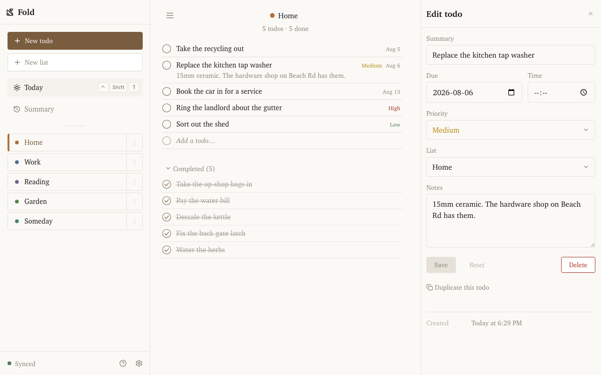
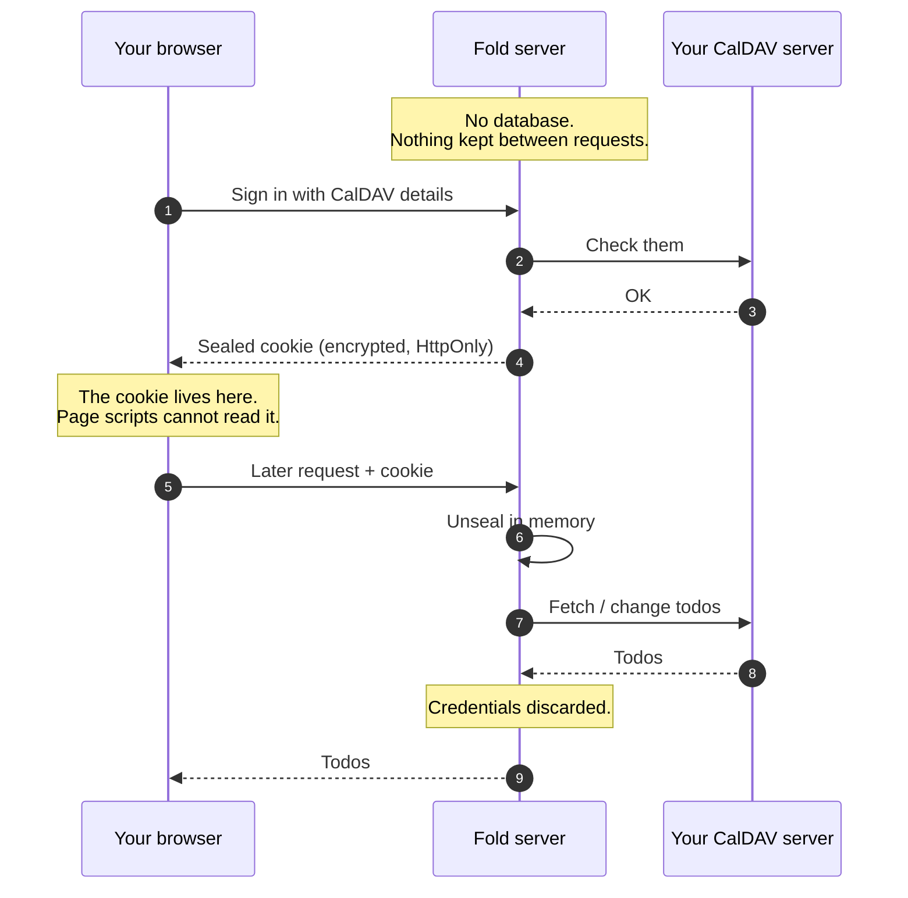

# Fold

A calm, offline-resilient todo client for any spec-compliant CalDAV server
(developed against Radicale). Bun BFF + React SPA.

Only the features you actually need: multiple lists, due dates, priorities,
notes. No notifications, no nagging, no streaks — just a quiet list that
syncs to your own server and works when the network doesn't.



Fold does not store your todos — your CalDAV server does. It keeps no
database and no accounts of its own: you sign in with your existing CalDAV
credentials, and everything lives on the server you already run.

## Personal software

This is personal software. I'm a software engineer, and Fold scratches an
itch that off-the-shelf todo apps didn't: it does what I want, the way I
want, and stops there. It may well not do what _you_ want — that's the
point, not an oversight. Feature requests are welcome but will be weighed
against one question: do I want it?

It's also written with LLM assistance, which I mention because people
reasonably want to know. That doesn't lower the bar — the standards are the
ones I'd hold any codebase I own to, and they're enforced by machines rather
than good intentions: type-aware linting, TypeScript at its strictest,
runtime validation at every trust boundary, and unit, integration and
end-to-end tests that run against a real CalDAV server. Every decision worth
keeping is written down in [docs/](docs/specs/overview.md) with the
reasoning intact. Judge it on the code and the tests, which is how it should
be judged either way.

## Running it

Deployment is via Docker. Releases publish an image to
[ghcr.io](https://github.com/JackCuthbert/fold/pkgs/container/fold), but
while this repository is private that image is not pullable — so for now
you build it from this checkout.

**1. Get the code and set a secret.**

```bash
git clone https://github.com/JackCuthbert/fold.git fold
cd fold
printf 'SESSION_SECRET=%s\n' "$(openssl rand -base64 32)" > .env
```

`SESSION_SECRET` encrypts the cookie that holds your CalDAV credentials.
Keep it private, and don't lose it — changing it signs everyone out.

**2. Start it.**

```bash
docker compose -f compose.prod.yml up -d --build
```

That serves the app and its API on `127.0.0.1:3000`, from a single
container. It is stateless — no volumes, nothing to back up.

**3. Put HTTPS in front of it.**

Not optional, and the step that catches people out — see
[HTTPS is not optional](#https-is-not-optional) below for why.

Point any reverse proxy at `127.0.0.1:3000`. With [Caddy](https://caddyserver.com),
a complete config with automatic certificates is two lines:

```caddyfile
fold.example.com {
	reverse_proxy 127.0.0.1:3000
}
```

nginx, Traefik, or a Tailscale/Cloudflare tunnel all work equally well.
**Nothing needs configuring on Fold's side** — it doesn't inspect the
request scheme or `X-Forwarded-*` headers, so there's no `trustProxy`
setting to get wrong.

**4. Sign in** at your domain with your CalDAV URL, username, and password.
For Radicale that URL usually looks like `https://dav.example.com/yourname/`.

To upgrade: `git pull && docker compose -f compose.prod.yml up -d --build`.

Full detail — image layout, configuration, health checks — is in
[docs/specs/deployment.md](docs/specs/deployment.md).

### No CalDAV server yet?

[`compose.yml`](compose.yml) runs a local [Radicale](https://radicale.org)
for trying Fold out. It's meant for local testing, not as your real server —
see [docs/user/local-caldav-server.md](docs/user/local-caldav-server.md).

## Before you trust it with your password

### Where your credentials go

You hand Fold your CalDAV password, so it's fair to ask what happens to it.
**Fold never stores it.** There is no user table and no session store — the
server keeps nothing between requests.



On sign-in your credentials are checked against your CalDAV server, then
encrypted (AES-256-GCM) into an `HttpOnly` cookie that only Fold can open —
JavaScript in the browser cannot read it. Each later request carries that
cookie; Fold unseals it in memory, talks to your CalDAV server, and keeps
nothing. Restarting the container loses no state, because there is none.

Detail: [docs/architecture/sealed-cookie-sessions.md](docs/architecture/sealed-cookie-sessions.md).

### HTTPS is not optional

That cookie is only as private as the connection carrying it. Fold marks it
`Secure`, and **browsers silently discard a `Secure` cookie sent over plain
HTTP** — so over `http://` you get the confusing version of broken: sign-in
appears to succeed, then the login screen comes straight back with no error.

Only the browser↔proxy hop needs TLS. Your CalDAV server does _not_ need
HTTPS for this to be correct — Fold talks to it server-to-server, with no
browser cookie involved.

**No TLS available?** On a LAN-only box or a `.local` hostname, set
`ALLOW_INSECURE_COOKIE=true` (see the commented line in
`compose.prod.yml`). This drops `Secure` so plain HTTP works — but that
cookie holds your CalDAV credentials, so anyone who can watch the network
can copy it. Only on a network you trust.

### Repeated sign-in failures are blocked

Fold's sign-in is the one thing an unauthenticated visitor can make it act
on: it takes a server URL and credentials and goes and tries them. Left
open, that turns your Fold into an anonymous way to guess passwords against
whatever it can reach on your network — with your server's address on the
requests, not the guesser's.

So after **5 failed attempts** against the same server-and-username, Fold
refuses more for 15 minutes and answers `429`. The count is per target, so
one locked account never blocks another, and a successful sign-in clears
it — mistyping twice and then getting it right costs you nothing. A CalDAV
server that is merely _down_ doesn't count against you either, or an
outage would lock you out of the app waiting for it to come back.

If you see "Too many failed attempts" and it wasn't you, someone is
guessing. Nothing is exposed by it — they still need working credentials —
but it is worth knowing.

### Browser-side hardening

Every response carries a strict `Content-Security-Policy`, plus
`X-Content-Type-Options`, `Referrer-Policy: no-referrer` and
`X-Frame-Options: DENY`. Fold serves its own client from its own origin and
self-hosts its fonts, so the policy can forbid outright what most apps have
to allow: no inline scripts, no third-party anything, and no framing.

`Referrer-Policy` earns its place here specifically — your Fold hostname is
itself identifying, and no referrer is ever sent.

**HSTS is deliberately not sent**, and you should not add it to Fold. If
you terminate TLS in front of it, set HSTS _there_. Fold cannot know
whether your deployment has a certificate — `ALLOW_INSECURE_COOKIE` exists
because some don't — and an HSTS header would pin browsers to HTTPS with no
way to undo it from the app.

Detail and reasoning: [docs/specs/security.md](docs/specs/security.md).

### What it does not do

- **No sub-tasks and no recurring todos.** Existing `RRULE` properties are
  preserved untouched, but Fold won't create or edit them.
- **No background sync.** Queued changes replay when you open the tab, not
  while it's closed.
- **One account at a time.**
- **It won't destroy what it doesn't understand** — properties from other
  CalDAV clients survive an edit
  ([round-trip preservation](docs/architecture/round-trip-preservation.md)).

## Development

```bash
bun install
SESSION_SECRET=$(openssl rand -hex 16) bun run --filter @fold/server dev
bun run --filter @fold/client dev   # second terminal
```

Open the Vite URL and sign in with your CalDAV server URL + credentials.

### Commands

| Command                        | What                                             |
| ------------------------------ | ------------------------------------------------ |
| `bun run lint` / `bun run fmt` | oxlint (type-aware, via tsgolint) / oxfmt        |
| `bun run typecheck`            | TS 7, strictest                                  |
| `bun run test`                 | unit tests (vitest)                              |
| `bun run test:integration`     | gateway vs a real Radicale (spawns a container)  |
| `bun run test:e2e`             | Playwright happy paths (needs Docker + chromium) |
| `bun run screenshot`           | regenerate the README screenshot                 |
| `bun run favicons`             | rebuild the favicon PNGs from `favicon.svg`      |

### Docs

- Specifications: [docs/specs](docs/specs/overview.md)
- Architecture decisions: [docs/architecture](docs/architecture)
- User guide: [docs/user](docs/user/getting-started.md)
- Agent rules: [CLAUDE.md](CLAUDE.md)
