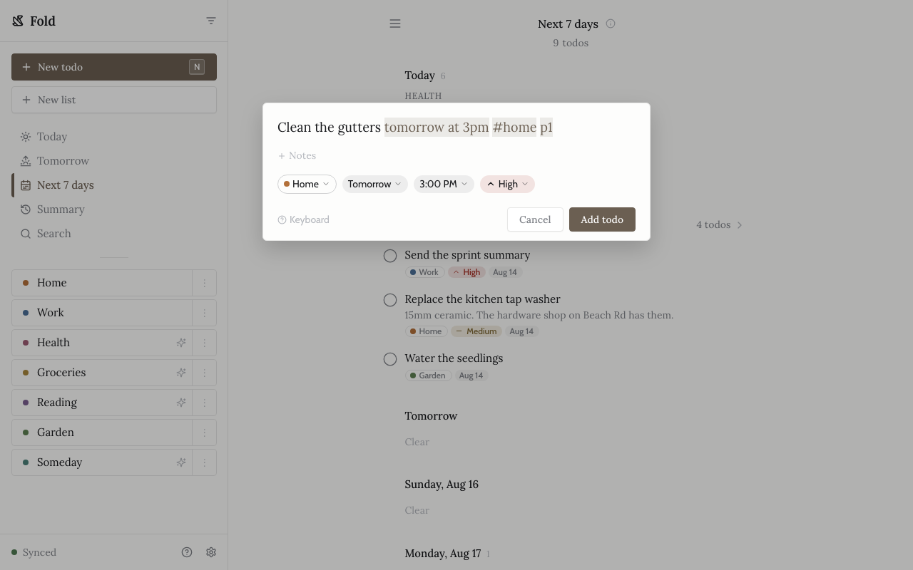
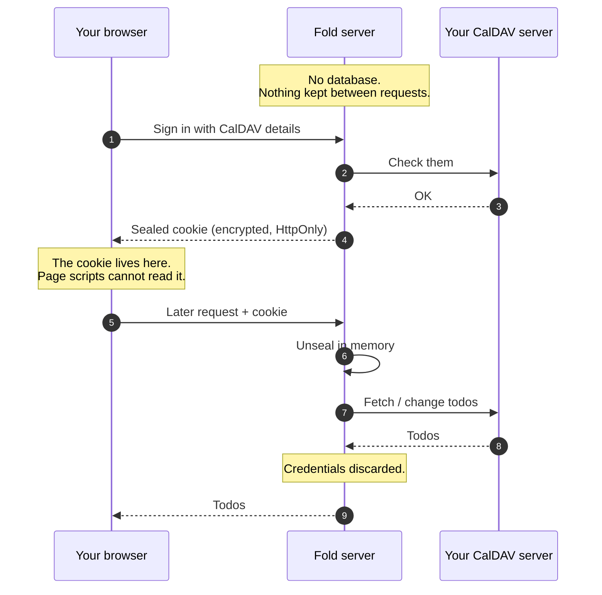

<!-- The header is HTML because GitHub's markdown has no way to centre
     anything, and `align="center"` on a div is the one thing it does
     honour. The mark is the generated `icon-192.png` rather than
     `favicon.svg`: GitHub strips `<style>` from rendered SVGs, and that
     file colours its strokes through a `prefers-color-scheme` block, so
     the SVG would arrive with no fill at all. The PNG bakes in the cream
     ground, which reads on both themes (e2e/build-favicons.mjs). -->
<div align="center">


# Fold

**A calm todo client for your own CalDAV server.**

</div>

| Today                                                                                | Quick add                                                                                                                              |
| ------------------------------------------------------------------------------------ | -------------------------------------------------------------------------------------------------------------------------------------- |
| [](docs/screenshot.png) | [](docs/screenshot-quick-add.png) |

## What it does

Works with any spec-compliant CalDAV server. Lists, due dates, priorities
and notes are stored as ordinary `VTODO`s that other clients can read.
On top of that:

- **Quick add.** `Clean the gutters tomorrow at 3pm #chores p1` becomes a
  todo with a due date, a time, a list and a priority. One line, one Enter.
- **Views your server doesn't have.** Today, Tomorrow, Next 7 days, Summary
  and Search, gathered across every list.
- **Recognised lists.** Name one `Health` and its todos lead every view in
  a block of their own. Health is the one thing that shouldn't wait behind
  a chore. `Groceries` collapses into a single row instead, because "did
  the shopping" is the useful fact, not twelve lines of shopping. No
  setting to find; the name is the whole configuration.
- **Works offline.** Changes queue locally and replay when the network
  returns. The app is usable on a train.
- **It won't break your data.** Properties from other clients survive an
  edit untouched.
- **Keyboard-first, and installable.** Shortcuts for everything; add it to
  a phone's home screen as a PWA.

No notifications, no streaks, no nagging. There's no account with me. You
sign in with your existing CalDAV credentials and your todos stay on your
server.

## Personal software

I built Fold for myself. Nothing I tried quite fit, and I wanted my todos
on hardware I control rather than in someone else's database. CalDAV
already solved the storage problem; I wanted a client I'd actually enjoy
using.

It's also a deliberate experiment in AI-assisted development end to end.
This is what that looks like when the bar doesn't move: full type
safety, tests at every layer against a real CalDAV server, every decision
written down with its reasoning in [docs/](docs/specs/overview.md), and
human review on all of it. I'd have built it the same way by hand; it
would just have taken longer.

Use it freely. It's [MIT licensed](LICENSE). Bug reports and fixes are
genuinely welcome, and [CONTRIBUTING.md](CONTRIBUTING.md) covers how.
Feature requests get weighed against one question: do I want it? So Fold
may never do what you want, and that's the point rather than an oversight.

Found a security problem? Please report it privately rather than in an
issue. [SECURITY.md](SECURITY.md) explains how.

## Running it

Docker, and one required setting.

```yaml
# compose.yml
services:
  fold:
    image: ghcr.io/jackcuthbert/fold:latest
    restart: unless-stopped
    ports:
      - '127.0.0.1:3000:3000'
    environment:
      # openssl rand -base64 32
      SESSION_SECRET: 'replace-me'
```

```bash
docker compose up -d
```

`SESSION_SECRET` encrypts the cookie holding your CalDAV credentials. Keep
it private; changing it signs everyone out. There's nothing else to
configure and nothing to back up, because Fold keeps no database.

Then put a reverse proxy in front of it and sign in with your CalDAV URL,
username and password. To upgrade: `docker compose pull && docker compose
up -d`.

Optional settings and image detail:
[docs/specs/deployment.md](docs/specs/deployment.md).

### HTTPS

Use it. The session cookie carries your CalDAV credentials, so the
connection needs to be private. Fold also marks the cookie `Secure`, so
browsers silently drop it over plain HTTP. Sign-in appears to work, then
bounces you back to the login screen.

Any reverse proxy will do. With [Caddy](https://caddyserver.com) it's two
lines and certificates are automatic:

```caddyfile
fold.example.com {
	reverse_proxy 127.0.0.1:3000
}
```

Only the browser↔proxy hop needs TLS; your CalDAV server doesn't.

**On a trusted LAN with no TLS?** Set `ALLOW_INSECURE_COOKIE=true` to drop
`Secure` so plain HTTP works. Anyone who can watch that network can then
copy the cookie, so only where you trust every device on it.

### No CalDAV server yet?

[`compose.yml`](compose.yml) in this repo runs a local
[Radicale](https://radicale.org) for trying Fold out. It's for local
testing only, not your real server. See
[docs/development/local-caldav-server.md](docs/development/local-caldav-server.md).

## Where your credentials go

You hand Fold your CalDAV password, so it's fair to ask what happens to
it. **Fold never stores it.** There is no user table and no session store.



On sign-in your credentials are checked against your CalDAV server, then
encrypted (AES-256-GCM) into an `HttpOnly` cookie that only Fold can
open. JavaScript in the browser cannot read it. Each later request
carries that cookie; Fold unseals it in memory, talks to your server, and
keeps nothing. Restarting the container loses no state, because there is
none.

Detail:
[docs/architecture/sealed-cookie-sessions.md](docs/architecture/sealed-cookie-sessions.md),
and [docs/specs/security.md](docs/specs/security.md) for the rest.

### Restricting which servers it will reach

By default Fold tries whatever server URL is typed into the login form,
which is what makes it work for everyone's setup. If your login page is
reachable by people other than you, name the servers it should accept:

```yaml
CALDAV_ALLOWED_HOSTS: 'dav.example.com, *.example.org, 192.168.1.10:5232'
```

Anything else is refused before a request goes anywhere. Left empty it
restricts nothing, which is the default.

## What it does not do

- **No sub-tasks and no recurring todos.** Existing `RRULE` properties are
  preserved untouched, but Fold won't create or edit them.
- **No background sync.** Queued changes replay when you open the tab, not
  while it's closed.
- **One account at a time.**

## Development

```bash
bun install
SESSION_SECRET=$(openssl rand -hex 16) bun run --filter @fold/server dev
bun run --filter @fold/client dev   # second terminal
```

Open the Vite URL and sign in with your CalDAV server URL + credentials.

| Command                        | What                                             |
| ------------------------------ | ------------------------------------------------ |
| `bun run lint` / `bun run fmt` | oxlint (type-aware, via tsgolint) / oxfmt        |
| `bun run typecheck`            | TS 7, strictest                                  |
| `bun run test`                 | unit tests (vitest)                              |
| `bun run test:integration`     | gateway vs a real Radicale (spawns a container)  |
| `bun run test:e2e`             | Playwright (needs chromium; Docker for one spec) |
| `bun run screenshot`           | regenerate the README screenshots                |
| `bun run favicons`             | rebuild the favicon PNGs from `favicon.svg`      |

Most e2e specs run against an in-memory fake CalDAV gateway inside the BFF,
so only the one real-CalDAV spec needs Docker. See
[docs/specs/testing.md](docs/specs/testing.md).

### Docs

- Specifications: [docs/specs](docs/specs/overview.md)
- Architecture decisions: [docs/architecture](docs/architecture)
- User guide: [apps/docs/guide](apps/docs/guide/getting-started.md)
- Development notes: [docs/development](docs/development)
- Agent rules: [CLAUDE.md](CLAUDE.md)

#### Reading the user guide

It's a [VitePress](https://vitepress.dev) site. It isn't published yet,
because GitHub Pages needs a public repo, so run it locally:

```bash
bun run docs
```

That serves it at `http://localhost:5174/fold/` with live reload. The
individual pages are readable as plain markdown in `apps/docs/guide` too;
the site adds search, navigation and rendered keycaps.

To check what would actually ship: `bun run docs:build`, then
`bun run docs:preview`. See
[docs/specs/docs-site.md](docs/specs/docs-site.md).
